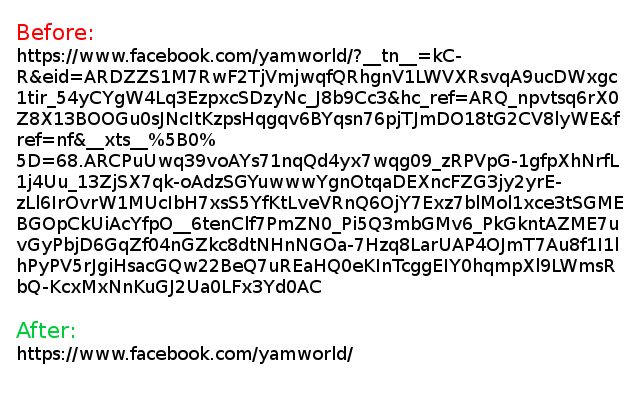
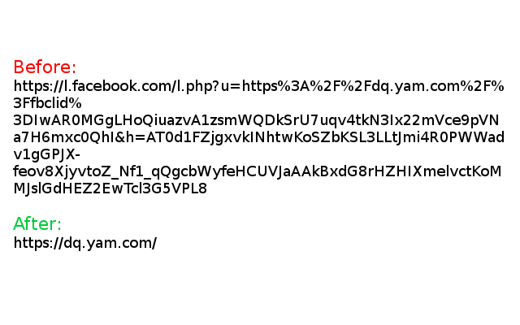
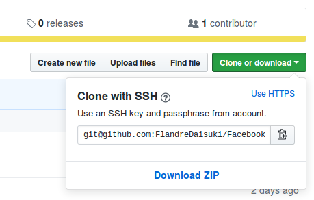
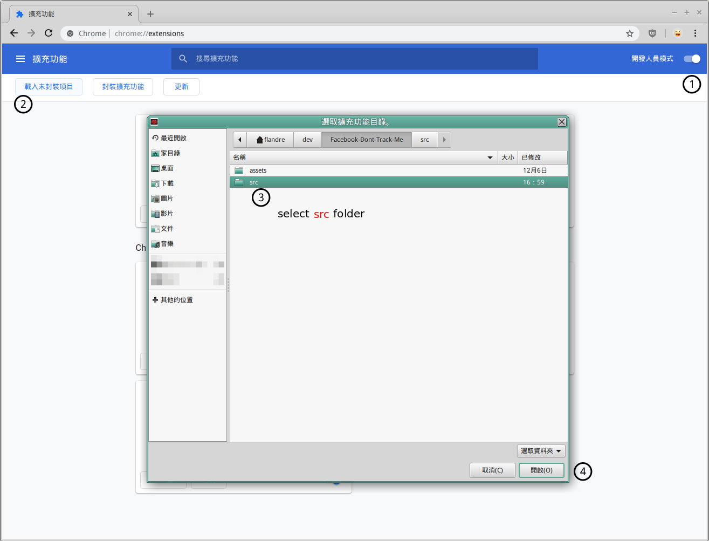

# Facebook Don't Track Me

Strip Facebook track parameters and clarify url

Inspired by [nboughton/nofbclid](https://github.com/nboughton/nofbclid)

## Examples

|An example of internal link in Facebook|An example of external link in Facebook|
|:-:|:-:|
|||

## Installation

### Firefox

### Chromium-based

1. Clone it or download the zip and unzip it

2. Open developer mode and load the **src/** in project folder

### Userscript (lite)

The userscript release can clarify url in address bar but the tracking parameters are still in requests.

1. After install script managers (Tampermonkey, ...) and click 

## Work with Other Extensions

* [Privacy Badger _by EFF Technologists_](https://addons.mozilla.org/firefox/addon/privacy-badger17/)

  They canceled `mousedown` event that I need, you can disable **Privacy Badger** in Facebook only

* [Facebook Container _by Mozilla_](https://addons.mozilla.org/firefox/addon/facebook-container/)

  Work well together

* [uBlock Origin _by Raymond Hill_](https://addons.mozilla.org/firefox/addon/ublock-origin/)

  Work well together

## LICENSE

The MIT License

Copyright (c) 2019 FlandreDaisuki \<vbnm123c@gmail.com>
