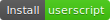

# Facebook Don't Track Me

Strip Facebook track parameters and clarify url

[[English](./README.md)] - [[正體中文](./README_zh-TW.md)]

- [Examples](#Examples)
- [Installation](#Installation)
  - [Firefox](#Firefox)
  - [Chromium-based](#Chromium-based)
  - [Userscript (lite)](#Userscript-lite)
- [Permission Explanation](#Permission-Explanation)
  - [tabs / contextMenus / clipboardWrite](#tabs--contextMenus--clipboardWrite)
  - [webRequest / webRequestBlocking / \<all_urls>](#webRequest--webRequestBlocking--all_urls)
- [Work with Other Extensions](#Work-with-Other-Extensions)
- [LICENSE](#LICENSE)

## Examples

|An example of internal link in Facebook|An example of external link in Facebook|
|:-:|:-:|
|||

## Installation

### Firefox

### Chromium-based

1. Clone it or download the zip and unzip it

2. Open developer mode and load the **src/** in project folder

### Userscript (lite)

The userscript release can clarify url in address bar but the tracking parameters are still in requests.

1. After install script managers (Tampermonkey, ...) and click 

## Permission Explanation

### tabs / contextMenus / clipboardWrite

These permissions are for the implementation of right click and copy the clarified link.

When click that function, the link will send to background and process it, then send back clarified URL to the tab you click and replace your clipboard content.

### webRequest / webRequestBlocking / \<all_urls>

The reason I use `<all_urls>` instead of Facebook's domain is the tracking parameter, like `fbclid`, are spread all over Facebook and non Facebook sites.

I don't want to send other sites these tracking parameters from non Facebook sites to other non Facebook sites.

The `webRequest` and `webRequestBlocking` can let me filter and clarify all requests.

## Work with Other Extensions

* [**Privacy Badger** _by EFF Technologists_](https://addons.mozilla.org/firefox/addon/privacy-badger17/)

  Protect privacy generally but they canceled `mousedown` event that we need, you can disable **Privacy Badger** in Facebook (facebook.com) only.

* [**Facebook Container** _by Mozilla_](https://addons.mozilla.org/firefox/addon/facebook-container/)

  Mozilla use Firefox Container technique to isolate Facebook from other sites.

* [**uBlock Origin** _by Raymond Hill_](https://addons.mozilla.org/firefox/addon/ublock-origin/)

  The well-known request filter extension, work well with our extension.

* [**Neat URL** _by Geoffrey De Belie_](https://addons.mozilla.org/firefox/addon/neat-url/)

  They handle addresses very well. Our extension checks your POST and AJAX requests additionally.

## LICENSE

The MIT License

Copyright (c) 2019 FlandreDaisuki \<vbnm123c@gmail.com>
