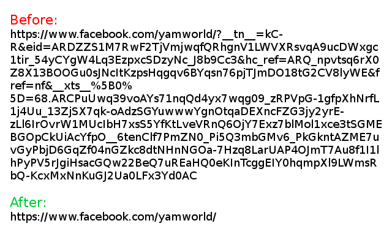

# Facebook Don't Track Me

刪除 Facebook 的追蹤參數及美化其網址

[[English](./README.md)] - [[正體中文](./README_zh-TW.md)]

- [範例](#範例)
- [安裝](#安裝)
  - [Firefox](#firefox)
  - [以 Chromium 為原型開發的瀏覽器](#以-chromium-為原型開發的瀏覽器)
  - [Userscript (閹割版)](#userscript-閹割版)
- [權限釋疑](#權限釋疑)
  - [tabs / contextMenus / clipboardWrite](#tabs--contextmenus--clipboardwrite)
  - [webRequest / webRequestBlocking / \<all_urls>](#webrequest--webrequestblocking--all_urls)
- [可以一起啟用保護隱私的附加元件](#可以一起啟用保護隱私的附加元件)
- [授權](#授權)

## 範例

|連到 Facebook 站內網址的例子|連到 Facebook 站外網址的例子|
|:-:|:-:|
|||

## 安裝

### Firefox

### 以 Chromium 為原型開發的瀏覽器

1. 複製 (clone) 下來或下載 zip 並解壓縮它

2. 啟用「開發人員模式」並載入專案資料夾內的 **src/**

### Userscript (閹割版)

這個 userscript 版本只能修改網址欄顯示的 URL，無法刪除修改背景送出的追蹤連線和參數。

1. 安裝腳本管理器（Tampermonkey 之類的）並點 

## 權限釋疑

### tabs / contextMenus / clipboardWrite

這三個是為了「右鍵複製乾淨鏈結」的功能實作所需的權限。

當你點下該功能的時候，鏈結會被送到背景處理，處理完的乾淨鏈結會被送回該分頁並覆蓋剪貼簿內容。

### webRequest / webRequestBlocking / \<all_urls>

我使用 `<all_urls>` 而非 Facebook 網域的原因是那些惱人的追蹤參數（如 `fbclid`）已經被傳染到非常多 Facebook 內及 Facebook 外的網站了。

我希望在 Facebook 之外的網站使用鏈結也能移除這些令人生厭的追蹤參數。

`webRequest` 和 `webRequestBlocking` 可以允許我攔截及修改連線請求的必要權限。

## 可以一起啟用保護隱私的附加元件

* [**Privacy Badger** _by EFF Technologists_](https://addons.mozilla.org/firefox/addon/privacy-badger17/)

  他們取消了我需要的 `mousedown` 事件，你可以只在 Facebook 停用 **Privacy Badger**

* [**Facebook Container** _by Mozilla_](https://addons.mozilla.org/firefox/addon/facebook-container/)

  可以一起啟用保護隱私

* [**uBlock Origin** _by Raymond Hill_](https://addons.mozilla.org/firefox/addon/ublock-origin/)

  可以一起啟用保護隱私

## 授權

The MIT License

Copyright (c) 2019 FlandreDaisuki \<vbnm123c@gmail.com>
